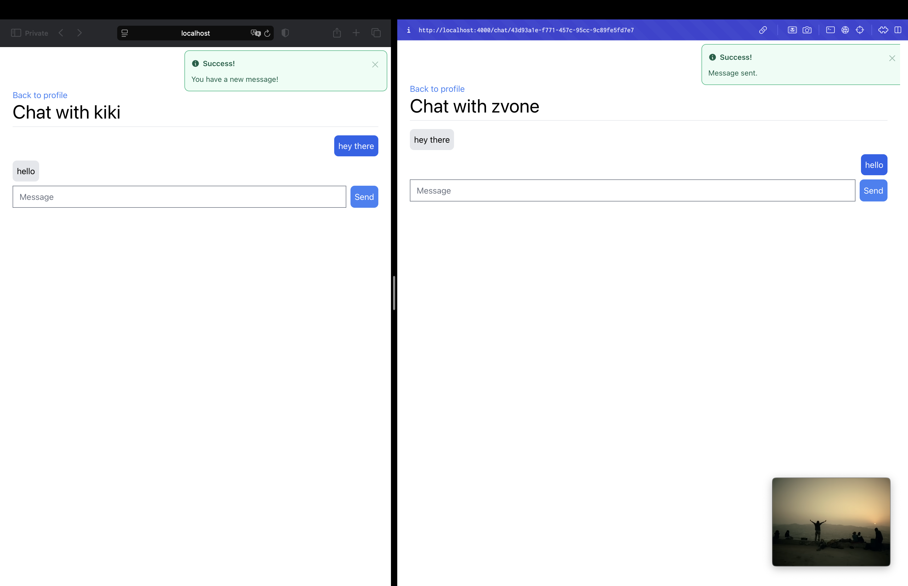

# Swipex
A simple Tinder-like clone written in Phoenix LiveView and using Neo4j.

**Note:** This project is still in development. It is not yet ready for production and is likely to have bugs and missing features.

## Development
Run `docker-compose up -d` to start the Neo4j database.

Run `mix deps.get && mix deps.compile` to install dependencies.

Start Phoenix endpoint with `mix phx.server` or inside IEx with `iex -S mix phx.server`

Now you can visit [`localhost:4000`](http://localhost:4000) from your browser.

